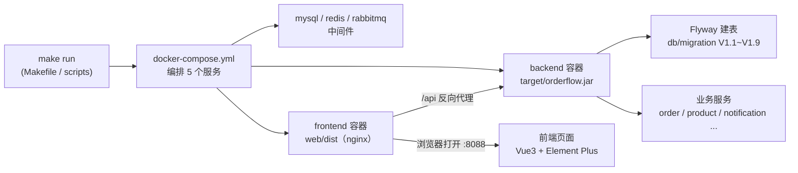

# OrderFlow 文件说明

> 这份文档的目标不是让你背下每个文件名，而是**看懂这个项目是怎么运转的**：先看全景关系图，再按建议顺序读，最后才是逐文件速查表。

---

## 一、项目全景：一条命令之后发生了什么



**读图提示**：所有操作都从 `make` 或 `scripts/` 里的脚本出发，最终收敛到 `docker-compose.yml`。它同时拉起三件套中间件 + 后端 + 前端；后端启动时 Flyway 自动建表，前端 nginx 把 `/api` 转发给后端。这条主线串起了仓库里一半的文件。

---

## 二、建议的阅读顺序

| 顺序 | 读什么 | 得到什么 |
|---|---|---|
| 1 | `README.md` | 这项目是干嘛的、有哪些技术亮点 |
| 2 | 本文件第一节全景图 | 文件之间怎么连起来的 |
| 3 | `docs/PROJECT.md` | 系统架构、核心流程、数据模型 |
| 4 | `docs/RUN.md` | 亲手把它跑起来 |
| 5 | `docs/INTERVIEW.md` | 面试怎么讲、会被追问什么 |

---

## 三、想改某块功能，去哪找

| 我想做这件事 | 去看 / 改这里 |
|---|---|
| 改下单、状态机、超时取消逻辑 | `src/main/java/com/orderflow/order/` |
| 改库存扣减、分布式锁防超卖 | `src/main/java/com/orderflow/product/`（`InventoryService` 等） |
| 改商品 / 分类 / 门店 / 顾客 / 营销 / 退款 | `src/main/java/com/orderflow/` 下同名包 |
| 改登录鉴权、JWT | `.../auth/` 与 `.../security/` |
| 新增一张表 / 字段 | `src/main/resources/db/migration/` 新增 `V1.10__xxx.sql` |
| 改中间件端口 / 账号密码 | `docker-compose.yml` + `src/main/resources/application.yml` **两处同步** |
| 改前端某个页面 | `web/src/views/` 对应目录 |
| 加一个后端接口 | 对应业务包的 `Controller` → `Service` |
| 改路由 / 三端门控 | `web/src/router/` |
| 改构建 / 启动流程 | `Makefile` 与 `scripts/` 对应脚本 |

---

## 四、逐文件速查

### 4.1 根目录

| 文件 / 目录 | 作用 |
|---|---|
| `README.md` | 项目门面：定位、亮点、架构图、快速开始、默认账号 |
| `FILES.md` | 本文件：看懂项目结构 + 逐文件速查 |
| `pom.xml` | Maven 构建配置（依赖、`finalName=orderflow` 决定 jar 名） |
| `mvnw` / `mvnw.cmd` | Maven Wrapper（macOS/Linux 用 `mvnw`，Windows 用 `.cmd`），无需本机装 mvn |
| `Makefile` | 命令入口：`make infra/build/run/stop/test/clean` |
| `docker-compose.yml` | 全栈编排：mysql / redis / rabbitmq / backend / frontend |
| `Dockerfile` | 后端镜像（`eclipse-temurin:17-jre` + `orderflow.jar`） |
| `src/` | 后端源码（见第五节） |
| `web/` | 前端源码（见第六节） |
| `target/` | 构建产物，被 gitignore，勿手改 |
| `docs/` | 文档目录 |
| `scripts/` | 脚本目录 |

### 4.2 scripts/ —— 脚本

| 脚本 | 作用 |
|---|---|
| `build.sh` | 一键构建：后端 jar → 前端 dist → docker 镜像 |
| `run.sh` | 一键启动全栈（前端 :8088 / 后端 /api） |
| `run-host.sh` | 宿主机模式启动后端（中间件用 docker，jar 跑本机） |
| `stop.sh` | 停止全栈，释放容器资源 |
| `smoke-test.sh` | 端到端冒烟测试，逐项 PASS/FAIL 汇总 |

### 4.3 docs/ —— 文档

| 文档 | 作用 |
|---|---|
| `PROJECT.md` | 工程化说明：架构、流程、数据模型、设计取舍 |
| `RUN.md` | 运行手册：环境、端口、两种启动方式 |
| `INTERVIEW.md` | 面试手册：亮点拆解 + 高频问答 |

---

## 五、后端 src/

- **入口**：`src/main/java/com/orderflow/OrderFlowApplication.java`（启动主类）
- **配置**：`src/main/resources/application.yml`（context-path=/api、数据源、Redis、RabbitMQ）
- **建表**：`src/main/resources/db/migration/`（Flyway 迁移 `V1.1`~`V1.9`）

**领域分包**（`src/main/java/com/orderflow/`，一个包对应一块业务）：

| 包 | 职责 |
|---|---|
| `auth/` `security/` | 认证鉴权：Spring Security + JWT、种子账号 |
| `order/` | 订单：状态机、超时自动取消、死信消费 |
| `product/` | 商品 + 库存：库存调整、分布式锁防超卖 |
| `category/` `store/` | 分类、门店 |
| `customer/` `platform/` | 顾客商城端、平台管理端（跨租户统计） |
| `promotion/` `refund/` | 营销满减、退款售后 |
| `notification/` `audit/` | 异步通知、审计留痕 |
| `common/` `config/` `domain/` | 公共设施、Spring 配置、领域模型 |

---

## 六、前端 web/

**顶层**：`package.json`（依赖）、`vite.config.ts`（构建 + dev 代理 /api）、`index.html`（SPA 入口）、`nginx.conf`（生产反代）、`Dockerfile`（nginx 镜像）。

**源码 `web/src/`**：

| 目录 | 职责 |
|---|---|
| `views/` | 页面（仪表盘、商品、库存、订单管理） |
| `router/` | 路由 + 三端门控 |
| `api/` | 后端接口封装（Axios） |
| `stores/` | Pinia 状态 |
| `layout/` `components/` | 布局、通用组件 |
| `types/` `utils/` `constants/` `styles/` | 类型、工具、常量、全局样式 |

---

## 七、隐藏目录与常用命令

| 路径 | 作用 |
|---|---|
| `.gitignore` | 排除 `target/` `node_modules/` `dist/` `.DS_Store` |
| `.github/workflows/ci.yml` | CI：编译后端 + 构建前端 + type-check |
| `.mvn/wrapper/maven-wrapper.properties` | 锁定 Maven 3.9.9 |
| `.vscode/settings.json` | 关 Java 自动编译、排除构建产物监听（省资源） |

```bash
make help      # 查看所有命令
make infra     # 只起中间件
make build     # 构建后端 + 前端
make run       # 一键启动全栈
make test      # 冒烟测试
make stop      # 停止并释放资源
```
