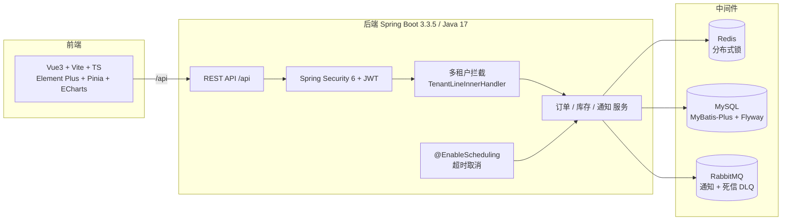
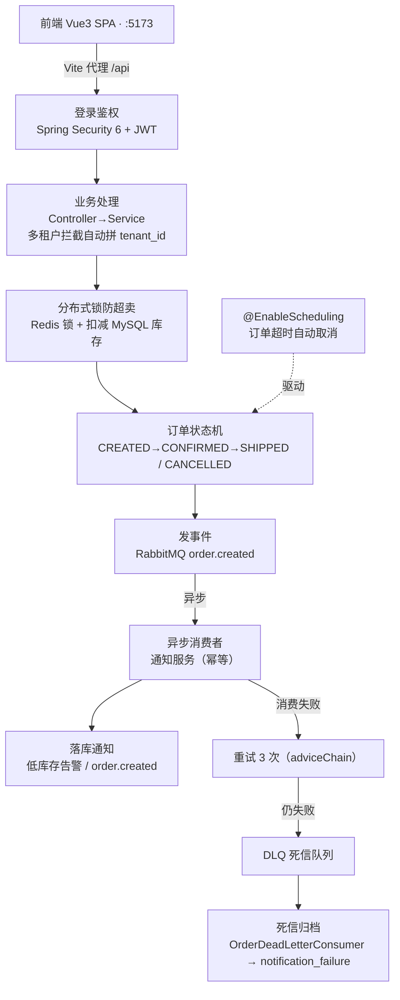

# OrderFlow

> 一个面向实习简历的**订单管理系统**：多租户 SaaS 订单流，覆盖下单、库存扣减、订单状态机、异步通知，以及一套能扛住异常的生产级可靠性兜底。

这个项目不是"能跑就行"的 demo，它刻意把几个面试常考的点做扎实了：多租户隔离、高并发防超卖、状态机、消息队列的异步解耦与死信兜底。下面先讲清楚它能展示什么，再看架构和流程。

---

## 文档导航

| 文档 | 说明 |
|------|------|
| [FILES.md](FILES.md) | 文件说明：逐个说明项目里每个文件/目录的作用 |
| [PROJECT.md](docs/PROJECT.md) | 工程化说明：系统架构、数据模型、关键设计取舍 |
| [RUN.md](docs/RUN.md) | 运行手册：一条命令起服务、端口约定、默认账号 |
| [INTERVIEW.md](docs/INTERVIEW.md) | 面试手册：技术亮点逐条拆解 + 高频问答 |

---

## 一、这个项目能展示什么（技术亮点）

每一项是简历上可以写、面试官可以追问的点，点开都能讲出实现细节：

- **多租户数据隔离**
  基于 MyBatis-Plus 的 `TenantLineInnerHandler` 做 SQL 拦截，所有查询自动拼上 `tenant_id`。租户 A 和租户 B 的数据在代码层无感知地彻底隔离，不用在每个 SQL 里手写条件。

- **高并发防超卖**
  下单时用 Redis 分布式锁锁住"商品维度"，库存扣减和订单创建放在同一事务边界内。锁保证不会两个请求同时扣同一件商品，事务保证"扣库存"和"建订单"要么都成、要么都回滚。

- **订单状态机**
  订单生命周期是 `CREATED → CONFIRMED → SHIPPED → COMPLETED`，以及终态 `CANCELLED`。状态只能按允许的边流转，非法跳转会被拒绝，流转过程可审计。

- **异步解耦 + 可靠性兜底（重点）**
  下单成功后发 RabbitMQ 事件，通知服务异步消费，不在主链路里等。消费失败时用 `adviceChain` 重试 **3 次**，仍失败则**拒收进 DLQ 死信队列**，由 `OrderDeadLetterConsumer` 归档到 `notification_failure` 表。好处是：毒消息既不丢、也不阻塞正常队列。

- **订单超时自动取消**
  `@EnableScheduling` 定时任务扫描"已创建但未支付"的订单，自动取消并回补库存，避免占库存不放。

- **可观测性**
  有真实的 `/api/health` 端点，逐个探活 MySQL / Redis / RabbitMQ；通知与死信都有结构化落库，方便排查。

---

## 二、技术栈

| 层 | 技术 |
|----|------|
| 后端框架 | Spring Boot 3.3.5 / Java 17 |
| 持久层 | MyBatis-Plus 3.5.7、Flyway（版本化建表） |
| 安全 | Spring Security 6 + JWT |
| 存储 / 中间件 | MySQL（业务）、Redis（分布式锁）、RabbitMQ（异步 + 死信队列） |
| 前端 | Vue 3 + Vite + TypeScript + Element Plus + Pinia + Axios + ECharts |
| 工程化 | Maven、Docker Compose、多租户 SQL 拦截 |

---

## 三、架构图



> 读图提示：请求从前端进 `/api`，先过 JWT 鉴权，再过**多租户拦截器**（自动拼 `tenant_id`），才到业务服务；业务服务同时依赖 Redis（锁）、MySQL（库）、RabbitMQ（异步）。

---

## 四、运行时流程图



> 读图提示：主线是"下单 → 加锁扣库存 → 状态机 → 发消息"；**右侧虚线是兜底链路**——消费出问题先重试 3 次，实在不行进死信队列归档，绝不让毒消息把队列堵死。

---

## 五、快速开始

中间件用 Docker Compose 起（MySQL 13306 / Redis 16379 / RabbitMQ 5672），后端 8080、前端 5173。

```bash
# 1. 起中间件
docker compose up -d

# 2. 编译后端
mvn -o -DskipTests clean package

# 3. 起后端（注意沙箱里要 unset 这个环境变量）
unset SERVER__PORT
java -Dserver.port=8080 -jar target/orderflow.jar

# 4. 起前端
cd web && npm install && npm run dev
```

打开 `http://localhost:5173` 即可。

## 六、默认账号

| 租户 | 账号 | 密码 |
|------|------|------|
| 租户 A | `admin-a` | `admin123` |
| 租户 B | `admin-b` | `admin123` |

> 注意：种子账号是 `admin-a` / `admin-b`（带租户后缀），不是 `admin`，这是多租户设计的体现。

---

## 七、目录结构（节选）

```
orderflow/
├── src/main/java/com/orderflow/
│   ├── common/        # HealthController、全局异常、多租户拦截
│   ├── auth/          # Spring Security + JWT、种子账号
│   ├── order/         # 订单状态机、超时取消、死信消费
│   ├── inventory/     # 库存、分布式锁防超卖
│   └── notification/  # 异步通知、低库存告警
├── src/main/resources/db/migration/  # Flyway 版本化建表
├── scripts/           # 构建 / 运行 / 停止 / 冒烟测试脚本
├── docs/              # 文档（PROJECT / RUN / INTERVIEW）
├── web/               # Vue3 前端
└── docker-compose.yml
```
