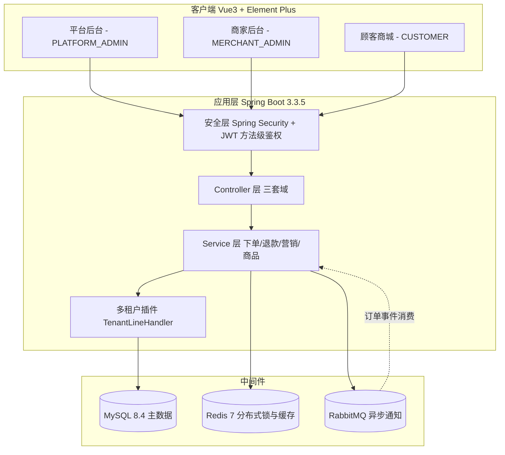
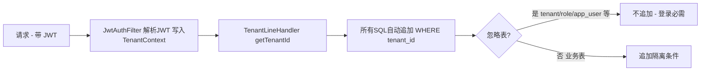
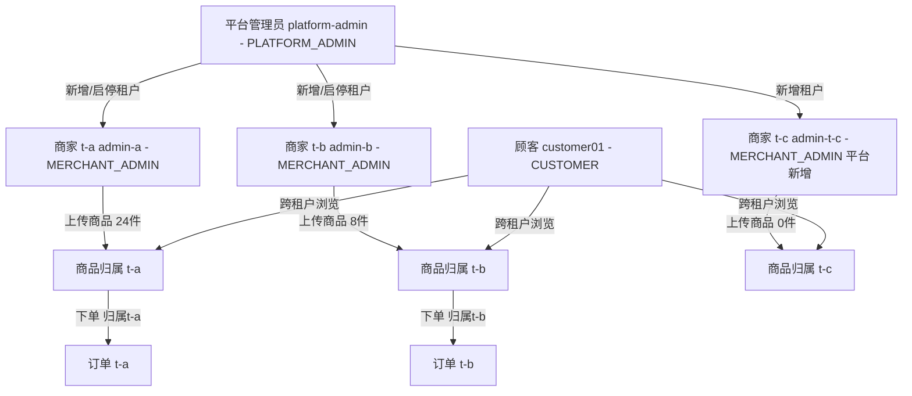
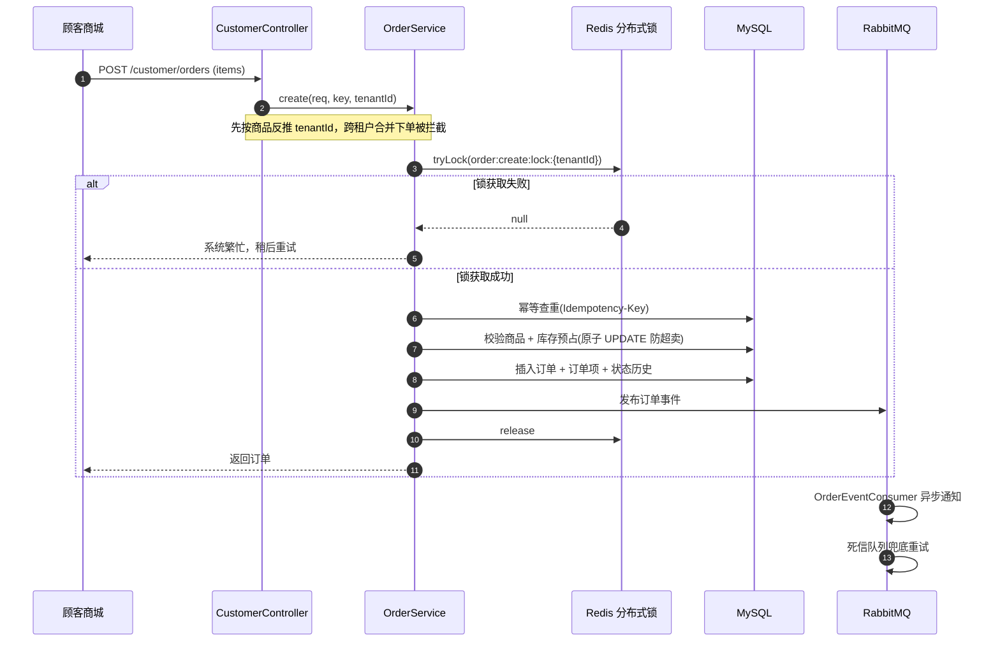
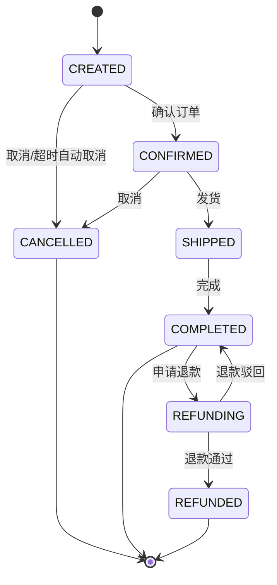
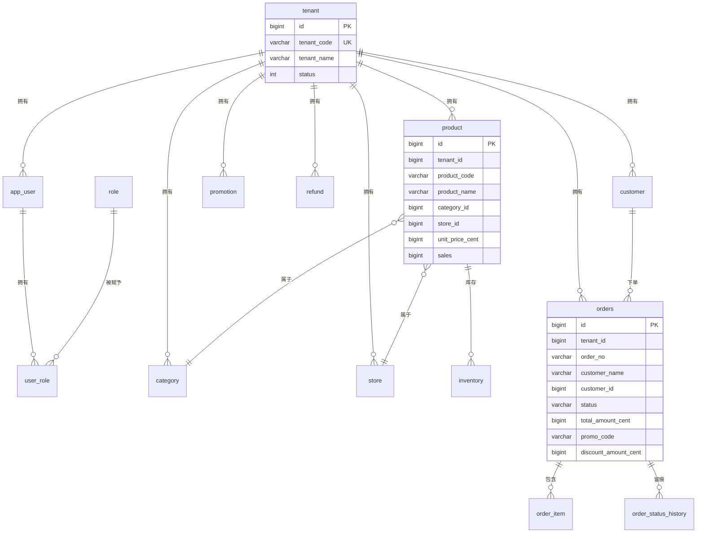

# OrderFlow 项目说明文档

> 一个 **B2B2C 多租户订单履约平台**：平台管理员治理商家、商家管理商品与订单、顾客在线下单，全程带多租户数据隔离、分布式锁、消息队列与状态机保障。
>
> 本文是项目的**工程化说明文档**，涵盖技术栈、系统架构、核心流程与数据模型，帮助快速建立全貌认知。

---

## 1. 项目概述

OrderFlow 用一句话概括：**「一套系统，服务多个商家（租户），每个商家有自己的商品、门店、优惠与订单，顾客跨商家浏览下单，订单自动归属对应商家。」**

| 维度 | 说明 |
|---|---|
| 定位 | 多租户订单履约平台（B2B2C） |
| 三端 | 平台后台（PLATFORM_ADMIN）/ 商家后台（MERCHANT_ADMIN）/ 顾客商城（CUSTOMER） |
| 核心能力 | 多租户隔离、分布式锁防超卖、RabbitMQ 异步通知、订单状态机、营销满减、退款售后、A/B 无关（此为 OrderFlow，非 InsightFlow） |
| 工程化 | Flyway 迁移、Docker Compose、Makefile、CI、冒烟测试 |

---

## 2. 技术栈

### 2.1 后端

| 技术 | 版本 | 用途 |
|---|---|---|
| Java | 17 | 运行环境 |
| Spring Boot | 3.3.5 | 应用框架 |
| Spring Security | 6.x（随 Boot） | 认证 + 方法级鉴权（@PreAuthorize） |
| MyBatis-Plus | 3.5.7 | ORM + 多租户插件（TenantLineInnerInterceptor） |
| Flyway | 随 Boot | 数据库版本化迁移（V1.1 ~ V1.9） |
| MySQL Connector/J | 8.x | 数据库驱动 |
| spring-data-redis | 随 Boot | Redis 分布式锁 + 商品缓存 |
| spring-amqp | 随 Boot | RabbitMQ 消息队列 |
| JJWT | 0.12.6 | JWT 签发与校验 |
| Lombok | 1.18.34 | 减少样板代码 |
| Actuator | 随 Boot | 健康检查 / 指标暴露 |

### 2.2 前端（`web/` 子工程）

| 技术 | 版本 | 用途 |
|---|---|---|
| Vue | 3.4 | UI 框架 |
| Vite | 5.3 | 构建工具 |
| TypeScript | 5.4 | 类型安全 |
| Element Plus | 2.7 | 组件库 |
| Pinia | 2.1 | 状态管理 |
| Vue Router | 4.4 | 路由 + 三端门控 |
| Axios | 1.7 | HTTP 客户端 |
| ECharts | 5.6 | 数据可视化（仪表盘） |

### 2.3 中间件与基础设施

| 组件 | 版本 | 端口 | 用途 |
|---|---|---|---|
| MySQL | 8.4 | 13306 | 主数据源 |
| Redis | 7 | 16379 | 分布式锁 / 商品缓存（密码 orderflow） |
| RabbitMQ | 3.13-management | 5672 / 15672 | 订单事件异步通知 + 死信兜底 |
| Docker Compose | — | — | 全栈一键编排 |

---

## 3. 系统架构

### 3.1 整体架构



**分层说明**：客户端三套入口（独立 token key）→ 安全层鉴权 → Controller 按域拆分 → Service 承载业务 → 多租户插件在 SQL 层自动追加 `tenant_id` 过滤（机制级隔离），中间件各司其职。

### 3.2 多租户隔离机制

隔离采用 **MyBatis-Plus 多租户插件（机制级）**，而非业务代码自觉写 `where tenant_id`：



**平台管理员跨租户**：`PlatformTenantInterceptor` 对 `/platform/**` 开启 `TenantContext.ignoreTenant=true`，让插件放行所有表，实现全平台聚合统计。

### 3.3 三端（角色）关系



---

## 4. 核心业务流程

### 4.1 顾客下单流程（含分布式锁 + 幂等 + MQ）



**关键点**：分布式锁 + 数据库原子 UPDATE 双重防超卖；`Idempotency-Key` 幂等防重复下单；订单状态写入 `order_status_history` 留痕。

### 4.2 订单状态机



### 4.3 平台新增租户（让商家进驻商城）

```mermaid
flowchart LR
    A[平台管理员 填 tenantCode + tenantName] --> B[POST /platform/tenants]
    B --> C{tenantCode 唯一性校验}
    C -->|已存在| D[40908 租户编码已存在]
    C -->|唯一| E[创建 tenant status=1]
    E --> F[自动创建商家管理员 admin-{tenantCode} 默认admin123]
    F --> G[关联 MERCHANT_ADMIN 角色]
    G --> H[商家登录后台 上传商品 顾客可见]
```

---

## 5. 数据模型（核心表）



---

## 6. 工程化说明

### 6.1 目录结构

```
orderflow/
├── README.md                 # 项目门面（简介 + 亮点 + 快速开始 + 文档导航）
├── Makefile                  # 统一命令入口（infra/build/run/stop/test/clean）
├── pom.xml                   # 后端依赖与构建
├── docker-compose.yml        # 全栈编排（mysql/redis/rabbitmq/backend/frontend）
├── Dockerfile                # 后端镜像
├── docs/                     # 文档（PROJECT / RUN / TECHNICAL_QA）
├── scripts/                  # 构建 / 运行 / 停止 / 冒烟测试脚本
│   ├── build.sh  run.sh  run-host.sh  stop.sh  smoke-test.sh
├── .github/workflows/ci.yml  # CI（后端编译 + 前端构建 + type-check）
├── src/main/java/com/orderflow/   # 后端，按领域分包
│   ├── auth/  order/  product/  refund/  promotion/
│   ├── customer/  platform/  category/  store/
│   ├── security/  config/  common/  domain/  notification/  audit/
├── src/main/resources/
│   ├── application.yml      # 应用配置（context-path=/api）
│   └── db/migration/        # Flyway 迁移 V1.1~V1.9
└── web/                     # 前端 Vue3 子工程
    └── src/{api,views,layout,router,stores,components,types,utils}
```

### 6.2 常用命令（Makefile）

| 命令 | 作用 |
|---|---|
| `make infra` | 仅启动中间件（MySQL/Redis/RabbitMQ） |
| `make build` | 构建后端 jar + 前端 dist |
| `make run` | 一键启动全栈（docker compose） |
| `make stop` | 停止并释放资源 |
| `make test` | 端到端冒烟测试 |
| `make clean` | 清理构建产物 |

### 6.3 数据库迁移（Flyway）

版本化迁移，向前演进不重置：`V1.1` 租户鉴权 → `V1.9` 商品销量字段。每次结构变更新增一个 `Vx.y__描述.sql`，杜绝手改库。

### 6.4 配置策略

- 本地开发：`application.yml` 直连 `127.0.0.1`（MySQL 13306 / Redis 16379 / RabbitMQ 5672）。
- 容器部署：`docker-compose.yml` 通过环境变量覆盖（`SPRING_DATASOURCE_URL` 等），JVM 限制 `-Xmx384m`。

---

## 7. 部署

```bash
# 方式一：docker compose 全栈（推荐）
make run                 # 或 ./scripts/run.sh
# 前端 http://localhost:8088，后端 /api

# 方式二：本地开发（中间件用 docker，应用跑宿主机）
make infra               # 起中间件
cd web && npm install && npm run dev    # 前端 5173
unset SERVER__PORT && mvn -DskipTests package && java -jar target/orderflow.jar  # 后端 8080

# 停止
make stop
```

> ⚠️ 本地启动后端前需 `unset SERVER__PORT`，否则该环境变量会覆盖 `server.port`。

---

## 8. 账号与演示

| 身份 | 入口 | 账号 | 密码 |
|---|---|---|---|
| 平台管理员 | 统一登录页选「平台管理员」 | platform-admin | admin123 |
| 商家 A（演示租户A） | 统一登录页选「商家后台」 | admin-a | admin123 |
| 商家 B（演示租户B） | 统一登录页选「商家后台」 | admin-b | admin123 |
| 顾客 | 统一登录页选「顾客商城」 | customer01 | admin123 |

> 三端共用一个登录页 `http://localhost:8088/login`，顶部 tab 切换身份（旧地址 `/platform/login`、`/shop/login` 会自动重定向到统一页对应身份）。

**演示路径**：平台登录 → 新增租户（如 t-c）→ 用新租户管理员登录商家后台上传商品 → 顾客商城看到新商品 → 下单自动归属对应商家。

---

## 9. 附：关键设计取舍

1. **多租户用「机制级」而非「约定级」**：MyBatis-Plus 插件自动注入 `tenant_id`，避免漏写 `where` 导致越权。
2. **跨租户是显式的**：商城浏览、平台统计用 `ignoreTenant` 临时放行，商家端默认强隔离——「默认安全，显式放行」。
3. **下单双重防超卖**：Redis 分布式锁串行化关键区 + 数据库原子 `UPDATE` 兜底。
4. **订单归属商品所在租户**：顾客跨商家下单时，订单 tenantId 取自商品而非登录身份，保证商家只见自己的单。
